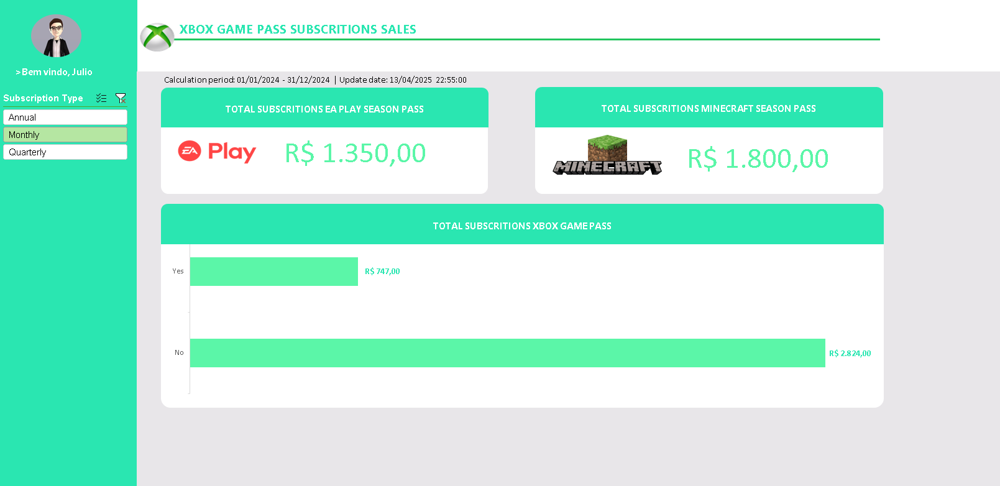

# Dashboard de Vendas do Xbox - Portfólio

## 📊 DIO-Vendas-do-Xbox


## 📋 Descrição do Projeto

Este repositório contém um dashboard interativo de análise de vendas do Xbox, desenvolvido como parte do desafio proposto pela plataforma DIO.me. O projeto transforma dados brutos de vendas em visualizações analíticas que facilitam a tomada de decisões estratégicas.
Utilizando o método de organização pessoal proposto por @felipeAguiarCode da DIO.

## 🎯 Objetivos do Projeto

- **Transformar dados brutos** em visualizações interativas e de fácil compreensão
- **Identificar padrões de vendas** e segmentos de mercado mais rentáveis
- **Fornecer insights acionáveis** para estratégias de marketing e vendas
- **Demonstrar competências** em análise de dados e visualização no Excel

## 🛠️ Tecnologias Utilizadas

- **Microsoft Excel**: Utilização avançada de funcionalidades como:
  - Tabelas dinâmicas
  - Recursos de visualização de dados
  - Segmentação de dados (Slicers)

## 🖥️ Estrutura do Dashboard

O dashboard foi estruturado para fornecer uma visão completa das vendas, com diferentes níveis de detalhamento:


## 📈 Principais Insights Obtidos

- Identificação dos períodos de apuração de vendas
- Segmentação de serviços

## 🔍 Prévia do Dashboard

> 

## 📁 Estrutura do Repositório
```
├── README.md # Documentação do projeto 
├── dashboard_xbox_sales.xlsx # Arquivo principal do dashboard 
└── screenshots/ # Capturas de tela do dashboard
```

## 🚀 Como Utilizar

1. Clone este repositório
2. Abra o arquivo `dashboard_xbox_sales.xlsx` no Microsoft Excel
3. Utilize os filtros interativos para explorar diferentes visualizações
4. Para atualizar os dados, substitua os dados na pasta "base" do arquivo Excel e execute a atualização

## 💡 Resultados Esperados

- **Visualizações claras e interativas** para facilitar a compreensão de dados complexos
- **Insights acionáveis** que podem guiar decisões estratégicas de marketing e vendas
- **Documentação clara e acessível** que demonstra o processo de análise e conclusões

## 🤝 Contribuições

Contribuições são bem-vindas! Se você tiver sugestões para melhorar o dashboard:

1. Faça um fork do projeto
2. Crie uma branch para sua feature (`git checkout -b feature/nova-analise`)
3. Faça commit das suas alterações (`git commit -m 'Adicionando nova análise de sazonalidade'`)
4. Envie para o branch original (`git push origin feature/nova-analise`)
5. Crie um Pull Request

## 📞 Contato

- LinkedIn: [[LinkedIn](https://www.linkedin.com/in/lairs/)]
- Portfolio: [[GitHub](https://github.com/lair/)]

---

⭐️ Desenvolvido como parte do desafio de Análise de Dados da DIO.me ⭐️
